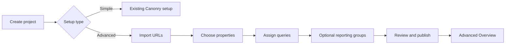

# Canonry Simple and Advanced Measurement UX

**Status:** Proposed design brief, not implemented  
**Written:** 2026-08-02  
**Governing constraint:** Advanced means more granular measurement, not a more complicated primary interface.

## 1. Outcome

Canonry will support two project experiences:

- **Simple:** the current project-wide Canonry setup and Overview.
- **Advanced:** target-level measurement with contextual user language such as Properties, Locations, Products, or Services.

The browser is a simple operator surface. It presents decisions, current status, actionable exceptions, and the next action. Raw measurement mechanics, provenance, revisions, execution details, and deep diagnostics remain available through the API, MCP, and agent explanations.

Google Search Console and Google Analytics remain project-wide and unchanged in this phase.

## 2. Product invariants

1. Simple remains the default for new and existing projects.
2. Existing Simple setup, navigation, Overview, sweeps, GSC, and GA remain unchanged.
3. An unpublished Advanced draft does not change reporting or execution.
4. Publishing an immutable measurement plan activates the Advanced experience.
5. Do not add a second project-mode flag initially:
   - no active plan means Simple;
   - an unpublished draft means Advanced setup is in progress;
   - an active plan means Advanced is active.
6. `Target` remains an API and database term only.
7. Each Advanced project configures a contextual singular and plural noun.
8. Targets own URL coverage and query assignments.
9. Reporting groups are optional comparison lenses. They never own queries or execution context.
10. Query definitions live once in the project query library. Assignment never duplicates a definition.
11. No generated query, imported URL, target, group, plan, or provider run is silently published or started.
12. Display terminology never changes stable IDs, measurement checksums, or historical attribution.



## 3. Design direction

This is a restrained product interface, not a visual rebrand.

- Preserve Canonry's existing dark theme, typography, spacing, and semantic colors.
- Use familiar controls: radio groups, tables, disclosures, search, filters, checkboxes, and native-feeling selectors.
- Keep one clear primary action per screen.
- Use tables and flat summaries instead of repeated metric-card grids.
- Show no more than three primary metrics in a reporting scope.
- Put secondary configuration behind progressive disclosure.
- Use motion only to communicate state, typically 150 to 250 ms.
- Avoid modals when an inline choice or disclosure is sufficient.
- Keep user-facing copy short and literal.

Reference behaviors:

- Linear for workflow clarity.
- Stripe for data tables and status hierarchy.
- GitHub for review and publication diffs.

## 4. Navigation and lifecycle

### Simple project

- Uses the existing setup flow.
- Uses the existing Overview.
- Does not fetch Advanced measurement data on normal Simple routes.
- Does not expose a new Portfolio workspace.

### Advanced draft

- The project remains Simple until publication.
- The setup entry shows `Advanced setup in progress`.
- Draft state is visibly unpublished.
- Returning to the project continues the draft.

### Advanced active

- Overview renders the Advanced measurement view.
- The contextual target noun becomes the navigation label, such as `Properties`.
- The target workspace manages setup and URL/query coverage.
- Results live in Overview, not inside the setup wizard.

### Deactivation

Changing an active Advanced project back to Simple is not a casual toggle. A future `Deactivate advanced measurement` action belongs in Project Settings, explains the effect on schedules and reporting, and preserves historical revisions.

## 5. Setup flow

The normal Advanced setup has four visible stages:

1. Import
2. Properties
3. Queries
4. Review and publish

Reporting groups are optional configuration inside the Queries stage or an optional subflow before Review. They do not need equal visual weight in the stepper.

### 5.1 Setup type

Place a standard radio fieldset after project creation.

**Simple**  
Track one query list across the whole project.

**Advanced**  
Measure properties, locations, products, or services separately.

When Advanced is selected, ask:

> What do you call the things being measured?

Supported presets:

- Properties
- Locations
- Products
- Services
- Brands
- Custom

Primary action: **Continue**

### 5.2 Import

Default controls:

- Sitemap, prefilled from existing configuration when available.
- One example target URL when Canonry has no saved discovery rule.
- **Find properties** or the contextual equivalent.

Supporting copy:

> Canonry will suggest properties and their URLs. You will review everything before publishing.

The normal screen does not expose host, path, alias, case, or exclusion vocabulary.

An **Advanced URL rules** disclosure contains:

- Primary host
- Path pattern
- Additional host
- Alias pattern
- Exclusions
- Path case behavior

Canonry must show the deterministic extraction rule and representative examples before scanning. It must not imply opaque AI inference.

Import result example:

> 194 properties found  
> 387 URLs covered  
> 22 other pages  
> 3 items need review

Use a flat summary, not four equal-weight cards.

A later manual rescan shows:

- New properties
- URL changes
- Properties no longer found
- Shared or unmatched pages

Nothing is added, removed, or published automatically. Existing URL coverage remains active until the administrator explicitly chooses `Keep current URLs` or `Use sitemap URLs`.

### 5.3 Properties

Heading:

> Choose properties to measure

Controls:

- Search
- Status filter: Included, Excluded, Needs review, URL changes
- Current-page selection
- **Select all 194 results**
- Sticky selection summary and primary action

Rows show:

- Property name
- Included state
- URL count
- Status
- **Review URLs** disclosure

Checkboxes mean `include in this setup`. Continue confirms the included set and advances.

Primary action example:

> Continue with 194 properties

Remove `Confirm selected Targets`. Back navigation preserves the selection.

Shared, unmatched, and non-property pages appear under **Other pages**, not mixed into the primary property table. Only ambiguous ownership or invalid configuration blocks publication.

### 5.4 Queries

Heading:

> Assign queries

Supporting copy:

> Choose which saved queries each property should be measured against.

Use a two-pane work area:

1. Select properties using search, metadata filters, reporting-group filters, or custom selection.
2. Select individual queries or a reusable query set.

The query library has three explicit sources.

#### Saved project queries

> These queries already belong to this project. Assigning them does not create copies.

#### Query sets

Reusable collections of saved project queries that can be applied in bulk.

#### Generated drafts

Property-specific queries expanded from an explicitly approved template or suggestion source.

Generated-draft flow:

1. Select properties.
2. Choose or enter a template.
3. Preview representative examples.
4. Show reused definitions, duplicates, and exceptions.
5. Approve the exact creation count.
6. Create and assign.

Do not require reviewing hundreds of nearly identical expansions individually. Show samples, totals, and exceptions.

Primary action example:

> Apply 5 queries to 194 properties

Secondary actions:

- Manage saved queries
- Create query set
- Create property-specific query drafts
- Advanced assignment options

Execution context appears under **Advanced assignment options** as **Run location**. Queries are never described as belonging to markets or reporting groups.

### 5.5 Reporting groups

This is an optional subflow, not a mandatory top-level step.

Heading:

> Reporting groups

Supporting copy:

> Compare selected properties and their competitors without changing which queries run.

A group contains:

- Name
- Selected properties
- Competitor domains

Groups may overlap. They own neither queries nor execution context.

Competitor editing stays inside an expanded group row. `Add competitors` is a small secondary action, never the primary action for a query page.

### 5.6 Review and publish

Compile and semantic diff run automatically when this stage opens and whenever relevant draft state changes.

Show only:

- Included properties
- Covered URLs
- Properties with assigned queries
- Total query assignments
- Reporting groups
- Changes from the active revision
- Actionable blockers linked to the responsible step

Remove:

- `Check plan`
- Estimated cost
- Raw compiler check names
- Execution nodes
- Usage edges
- Matcher terminology
- Revision mechanics from primary content

Primary action: **Publish setup**

Supporting copy:

> Publishing makes this setup active. It does not start a measurement run.

After publication:

- Rebase or clear the draft.
- Show the active revision as quiet operator detail.
- Offer **Run first measurement** or **Open Overview**.
- Do not keep Report as another wizard step.

## 6. Advanced Overview

Advanced Overview is distinct from the existing Simple Overview. A group selector must never sit above metrics that remain project-wide.

The primary page contains:

1. Current measurement state and last-updated time.
2. One scope selector.
3. No more than three primary metrics.
4. One dominant table.
5. One collapsed actionable-exceptions section.
6. A quiet path to deeper agent analysis.

Example:

```text
Latest measurement: Complete · Updated Aug 2       View: [All properties ▾]

Properties cited        Citation coverage        Measurement complete
74 / 194                38%                      1,164 / 1,164

Properties
Name                  Groups       Citation       Mention       Status
Property One          Dallas       42%            58%           Complete
Property Two          Dallas       31%            44%           Complete

Results needing review (3) ▾
```

### 6.1 Scope selector

Use one searchable selector with three sections:

- All properties
- Reporting groups
- Properties

Store scope in the URL. Unknown or retired IDs fall back to All and are removed from the URL.

### 6.2 All properties

Primary metrics:

- Properties cited
- Citation coverage
- Measurement completeness

Primary content:

- Property performance table
- Collapsed reporting-group comparison
- Results requiring review

The overall values come from a backend aggregate over unique execution slots. Never sum or average property or group rows.

### 6.3 Reporting group

Primary metrics:

- Properties cited
- Citation coverage
- Completeness

Primary content:

- Brand presence
- Member-property table
- Quiet **Manage group** link for administrators

Competitor lists remain group-specific. Never merge competitor rosters from overlapping groups.

### 6.4 Property

Primary metrics:

- Citation coverage
- Mention coverage
- Completeness

Primary content:

- Provider breakdown
- Assigned query count
- Covered URLs
- Reporting-group membership
- Matched-source evidence

### 6.5 Metric and evidence language

| Internal | UI |
| --- | --- |
| `answerCoverage` | Citation coverage |
| `targetCoverage` | Properties cited |
| `sov` | Brand presence |
| `assigned` | Matched this property |
| `sibling` | Matched another property |
| `ownedUnmapped` | Owned URL not assigned |
| `ambiguous` | Matches multiple properties |
| `external` | External source |
| `invalid` | Unreadable URL |
| `bridged` | Historical result |
| `evidenceIncomplete` | Source list incomplete |

The current competitor metric is independent answer presence and can total above 100 percent. Do not call it Share of Voice unless the backend implements a true share calculation.

### 6.6 Complexity boundary

The browser does not need to expose every available field.

Primary UI excludes:

- Execution IDs and slot manifests
- Usage edges
- Raw URL matcher definitions
- Raw diagnostics arrays
- Provider/model series hashes
- Checksum internals
- Full provenance payloads
- Every historical observation

The API and MCP retain these details. Aero or another connected agent can explain them, compare revisions, diagnose attribution, and produce deeper analysis on request.

The UI must still expose uncertainty that changes a decision: partial results, stale data, incomplete evidence, ambiguous attribution, and publication conflicts.

## 7. Required states

| State | UI behavior |
| --- | --- |
| Loading | Skeleton matching the final layout |
| Published, never run | `Run first measurement` |
| No assigned queries | Link to Assign queries |
| Partial run | Show executed versus expected counts |
| Missing citation evidence | Display unavailable, never zero |
| Missing aliases | `Mention tracking is not configured` |
| No competitors | Omit Brand presence or state none are configured |
| Cached result plus refresh failure | Retain results and show a small stale-data warning |
| Revision mismatch | Withhold mismatched results and offer Refresh |
| URL ownership conflict | Link directly to URL review |
| Publish conflict | Preserve draft and reload active revision |
| Viewer | Full read-only inspection with no dead mutation controls |

## 8. Roles

### Administrator

- Imports, edits, assigns, previews, and publishes.
- Sees explicit draft and publication status.
- Can start measurements.

### Viewer

- Can inspect active setup, safe previews, reports, and evidence.
- Sees: `View only. An administrator can change or publish this setup.`
- Does not receive editable controls that fail only at the final step.
- Remains protected by server-side authorization.

Use the existing auth account context and `canWrite` capability. Do not create another role system.

## 9. Durable backend requirements

These do not block component decomposition, but they block a robust release.

### 9.1 Authoring

1. **Server-side setup draft**
   - project ID
   - base revision
   - schema version
   - authoring payload
   - updated timestamp
   - updated by
   - optimistic concurrency

2. **Reusable query sets and templates**
   - Persist as project-level authoring assets.
   - Resolve into immutable target-query assignments at publication.
   - Keep runtime execution independent from mutable templates.

3. **Query provenance**
   - Expose provenance in `QueryDto`.
   - Distinguish manual, discovery, template, and generated origins.
   - Reuse existing definitions rather than creating duplicates.

4. **Discovery-rule persistence**
   - Persist the approved sitemap extraction rule.
   - Support deterministic rule suggestion and preview from a sitemap plus example URL.
   - Do not present a one-field import until required host/path rules can be inferred or recalled honestly.

5. **Contextual noun persistence**
   - Store presentation terminology outside the immutable plan checksum.

### 9.2 Reporting

1. Add an overall portfolio aggregate computed from unique assignments and execution slots.
2. Ensure unassigned properties do not inflate group-coverage denominators.
3. Add query ID and expected property identity to evidence rows.
4. Add scoped measurement history with visible revision and engine-series boundaries.
5. Preserve unavailable versus zero semantics.

## 10. Frontend architecture

Do not extend the current monolithic Portfolio or Project page components.

```text
project/advanced-measurement/
  AdvancedMeasurementWorkspace
  terminology
  scope
  useAdvancedMeasurementData

  setup/
    MeasurementSetupWizard
    setup-reducer
    ImportUrlsStep
    ReviewPropertiesStep
    AssignQueriesStep
    QueryDraftReview
    ReportingGroupsSection
    ReviewPublishStep

  report/
    AdvancedOverview
    MeasurementScopeSelect
    MeasurementSummary
    GroupComparisonTable
    PropertyPerformanceTable
    PropertyEvidence

  model/
    setup-model
    report-view-model
```

Implementation rules:

- Reducer-driven setup lifecycle.
- React Query for server operations.
- Pure adapters between API contracts and user-facing language.
- Stable IDs for identity and selection.
- Simple Overview protected by characterization tests.
- GSC and GA receive no new scope state or fetching behavior.

## 11. Scale, accessibility, and responsive behavior

For 213 properties:

- Paginate at 50 rows with visible page controls.
- Support current-page and all-filtered selection separately.
- Use stable selection by property key.
- Memoize assignment indexes.
- Never render a property-by-query matrix.
- Preview generated queries using samples and exception counts.
- Test 0, 1, 50, 194, 213, and 1,000 properties.

Accessibility:

- Mode selection uses a `fieldset`.
- Stepper uses `aria-current="step"`.
- Focus moves to the new step heading.
- Selection, loading, and publication changes use appropriate live regions.
- Table headers use `scope`.
- Standalone controls are at least 44 pixels.
- Meaningful copy is at least 13 pixels with sufficient contrast.
- Keyboard-only completion and 200 percent zoom work.
- Sticky actions account for the Aero command bar.
- Reduced-motion preferences are respected.

Responsive behavior:

- Desktop uses dense tables and a persistent selection footer.
- Tablet stacks query selection above assignment summary.
- Narrow screens shorten the step label, preserve searchable controls, and move secondary row content into disclosures.
- Evidence tables may scroll horizontally when preserving tabular comparison is more understandable than card conversion.

## 12. PR plan

Begin after the current stack is merged and `main` is stable.

1. **UI foundation**, approximately 0.5 agent-day
   - Extract components, terminology, reducer, and Simple characterization tests.

2. **Authoring backend**, approximately 0.75 to 1 agent-day
   - Drafts, query sets and templates, query provenance, discovery rules, contextual noun.

3. **Reporting backend**, approximately 0.75 to 1 agent-day
   - Overall aggregate, denominator correction, evidence identity, scoped history.

4. **Advanced setup UX**, approximately 1 agent-day
   - Mode selection, import, property review, assignment, optional groups, publication.

5. **Advanced Overview**, approximately 0.75 to 1 agent-day
   - Scope selector, simplified summaries, property table, evidence, URL state.

6. **Hardening**, approximately 0.5 agent-day
   - Viewer states, scale, accessibility, responsive QA, live Cortland validation.

Total: approximately 4 to 5 agent-days including tests and visual QA. Agents can work on UI foundation, authoring, and reporting in parallel, then integrate on the new `main`.

## 13. Acceptance gates

- Existing Simple setup and Overview remain unchanged.
- Simple routes do not fetch Advanced measurement data unnecessarily.
- Advanced draft state does not alter reporting or execution.
- All imported properties are reachable, searchable, and selectable.
- Continue confirms property selection and preserves it on Back.
- Generated queries remain drafts until explicit approval.
- Query assignment never duplicates definitions.
- Query sets and templates survive publication and later editing.
- Groups never own queries or execution context.
- Competitors only appear within groups.
- No primary UI exposes Target, sibling, compile, matcher, execution node, usage edge, or estimated cost.
- No reporting scope shows more than three primary metrics.
- Overlapping groups do not inflate All totals.
- Partial or missing evidence never renders as zero.
- Viewer setup is genuinely read-only.
- Publishing does not trigger provider calls.
- GSC and GA remain unchanged.
- Synthetic fixtures contain no client names, domains, or slugs.
- API and MCP retain full diagnostic and measurement depth for agents.

## 14. Implementation approval

This file is the proposed design brief. Confirm or revise it before implementation begins. Once confirmed, its relevant sections should be copied into the governing PR descriptions, consistent with Canonry's documentation policy.
