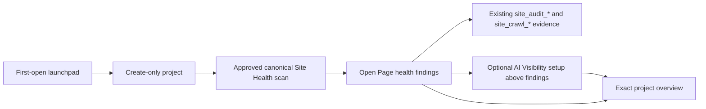

# Canonry OSS onboarding rework: reveal the operating platform

## The rework in one sentence

This is not a shorter setup wizard. It changes Canonry's first mental model from an LLM query runner into an evidence-connected AEO operating platform.

Queries are sensors, not the product. Google Search Console is one evidence source, not the hook. Aero is an operator, not a support chatbot. The dashboard is the human workroom for understanding state, approving action, and inspecting evidence.

## Product language: SEO, AEO, GEO, and AIO

The industry is still aligning on these terms. For an operator, these labels
describe the same work: improve content, observe results, and measure changes.

Canonry uses **AEO** internally and **AI search visibility** during onboarding.
The first experience shows value before it explains the taxonomy.

## Current-main reassessment: Site Health becomes the hook

This scope was rebased and re-evaluated against `origin/main` at `2067a987f`, including the full-crawl graph plumbing in #976 and the agent-first Site Health map in #978.

The new implementation changes the first-value strategy:

- one Site Health scan now produces the technical audit, page inventory, internal-link graph, stable server-side layout, site sections, and exact page findings
- the project tab is labeled **Site Health**, keeps the stable `/technical-aeo` route, and opens on **Map**
- the map is not a decorative onboarding illustration; it is a durable product surface backed by the same evidence available to API, CLI, MCP, and agents
- the previous 5–10 page probe would create a weak topology and cannot use the current Site Health reads, which deliberately exclude probe runs

The revised recommendation is therefore:

    Domain
      → approved canonical Site Health scan
      → Page health fixes
      → optional AI Visibility setup
      → Project overview

“Technical audit” is the action. Page health is its first result during onboarding.

### Implementation decision: one explicit setup flow

The shipped onboarding no longer enters the project shell and overlays a guided tour. First open stays on `/setup` and uses real product data in three explicit stages:

1. **Site audit** creates the project and runs the canonical persisted crawl.
2. **Page health** opens automatically with the scan's checks, affected pages, and fixes. The normal Site Health map and inventory remain available after setup.
3. **AI Visibility** appears above the Page health findings, reuses the project-scoped visibility setup, and can be skipped.

Finishing or skipping AI Visibility replaces the setup route with the exact project overview (`/projects/:name`). The exact project and Site Health run remain recoverable from URL and server state during setup. No local onboarding-complete flag or tutorial state is added, and graph-layout failure does not block Page health or the AI Visibility decision.

## Decision

The first UI experience should show Canonry's operating loop before asking the user to configure its paid or connected parts:

    Map and check the site
        ↓
    Define what Canonry should measure
        ↓
    Connect demand and observe AI/search outcomes
        ↓
    Diagnose and take a reviewed action
        ↓
    Verify the result and keep watching
        ↺

The domain is the opening input. Canonry creates a minimal project and runs an approved provider-free Site Health scan while the operator remains in the focused `/setup` flow. Page health is the first retained proof that Canonry understands the site's pages and can identify concrete fixes.

The destination is not “setup complete” or a raw visibility count. It is an operating brief that answers:

1. What did Canonry find?
2. Why does it matter?
3. What is the next safe action?
4. What evidence supports that conclusion?
5. What should Canonry keep watching?

## How the team evaluated it

The review combined four disciplines:

| Discipline | Question |
| --- | --- |
| Product management | What product should a new operator believe Canonry is? |
| UX | What is the fastest path to a real, memorable value moment? |
| Product UI | How can the interface show breadth without creating a feature tour or configuration wall? |
| Software engineering | Which capabilities are actually shipped, which can run without credentials, and what new orchestration is required? |

The review inspected the current first-run route, project navigation, Site Health crawl/graph execution, Advanced Measurement draft flow, integrations, agents, CLI/API/MCP surfaces, reporting, automation, and the previous GSC/GA analysis.

This is a source-based expert evaluation, not a recruited usability study. It should be validated with people opening a fresh OSS install for the first time.

## What the previous evaluation missed

The previous document improved the mechanics of starting query tracking, but kept the wrong product frame:

- It made GSC the primary hook.
- It treated a visibility sweep as the main aha moment.
- It defined activation through stored answer snapshots.
- It deferred most of Canonry's power until after onboarding.
- It gave Aero no meaningful role in the first value experience.
- It changed Setup without changing the project home the user enters afterward.
- Google OAuth mechanics occupied more space than the product vision.

That still teaches the user that Canonry is a tool for choosing prompts and calling LLM APIs.

The valid parts remain: domain first, GSC optional, explicit provider spend, editable demand suggestions, competitors later, and truthful fallback paths. They now sit inside a broader operating-platform model.

## Why the current UI feels like a query tool

The experience accurately teaches the narrow mental model:

1. A fresh root visit redirects to Setup when no project exists.
2. The normal sidebar is hidden during first-run Setup, so the platform's breadth disappears.
3. The wizard is System check → Create project → Queries → Competitors → Launch.
4. Provider readiness blocks progress before Canonry learns about the site.
5. Questions and competitors dominate the user's work.
6. The first result is framed through mentioned, cited, and result counts.
7. Site Health, search evidence, indexing, traffic, backlinks, local presence, reports, schedules, notifications, actions, Aero, MCP, and API control appear later or outside the main UI.

Repository evidence:

- First-run shell behavior: [App.tsx](../apps/web/src/App.tsx)
- Five-step flow: [SetupPage.tsx](../apps/web/src/pages/SetupPage.tsx)
- Visibility-led project overview: [ProjectPage.tsx](../apps/web/src/pages/ProjectPage.tsx)
- Map-first Site Health orchestration: [SiteHealthSection.tsx](../apps/web/src/components/project/SiteHealthSection.tsx)
- Persisted WebGL graph renderer: [SiteGraphSigma.tsx](../apps/web/src/components/project/SiteGraphSigma.tsx)
- Crawl/graph API contract: [technical-aeo.ts](../packages/contracts/src/technical-aeo.ts)
- Crawl executor and terminal layout publication: [execute-site-audit.ts](../packages/canonry/src/execute-site-audit.ts)
- Full product promise: [README.md](../README.md)

## What Canonry already is

Canonry already spans the full operating loop. The onboarding should reveal these roles as one system.

| Operating role | Shipped capability | What the user should understand |
| --- | --- | --- |
| Map the site | Canonical Site Health crawl, page/internal-link map, Inventory, exact page evidence, Properties/groups, versioned measurement plans | Canonry understands the site as structured surfaces, not only as a domain string. |
| Discover demand | GSC suggestions, Query Discovery, Research, manual/imported questions | Questions come from evidence and intent, not only a prompt text box. |
| Observe AI visibility | Multi-engine answer runs, independent mention and citation evidence, model/location comparisons | Canonry records what answer engines said, cited, and changed over time. |
| Observe search and indexing | GSC and Bing performance, coverage, sitemaps, inspections, indexing actions | AI visibility is grounded in search demand and index state. |
| Observe real activity | GA4, server-side crawler activity, AI referrals, Cloud Run, Vercel, and WordPress traffic sources | Canonry can connect visibility to crawling, visits, and outcomes. |
| Observe local and authority signals | Google Business Profile and Common Crawl backlinks | Local presence and authority are part of the operating picture. |
| Diagnose | Site Health technical checks, competitor gaps, content targets, cited sources, trends, regressions | Canonry explains likely causes and identifies the highest-value gap. |
| Improve safely | Content briefs, WordPress operations, structured data, sitemap/indexing actions, approved ad operations | Recommendations can become bounded, reviewable actions. |
| Verify | Stored evidence, diffs, history, reports, repeat measurements | Canonry proves whether the state changed after work was done. |
| Keep operating | Schedules, notifications, webhooks, Aero, external agents, MCP, CLI, API, config as code | Canonry is a persistent control plane, not a one-off report. |

Not every shipped capability has a full web-native control today. WordPress, content operations, Ads, and parts of configuration are CLI/API/MCP-first. The UI should show truthful handoffs instead of implying controls that do not exist.

## The product aha moment

The immediate onboarding aha is specific:

> Canonry checked my site, showed which pages need attention, and explained the fixes. Now I can optionally see whether answer engines mention and cite me.

The visual map remains a retained Site Health capability after setup; it is not an onboarding step.

The later, connected aha remains:

> Canonry found demand for this topic, showed that answer engines cite other sources instead of me, tied the gap to the relevant site surface, and proposed one safe next action with evidence.

There are four value moments:

1. **Site understood:** Canonry publishes real Page health evidence without requiring an LLM credential.
2. **First finding:** A real check exposes affected pages and remediation.
3. **Connected operating brief:** Canonry combines the evidence available so far into one conclusion and next action.
4. **Retention proof:** Canonry returns later and explains what changed without being asked.

A completed query run is useful evidence, but it is not the product definition.

## Recommended first-open experience

The first screen should establish the platform, request one input, and provide one primary action.

    ┌────────────────────────────────────────────────────────────────────┐
    │ CANONRY                                      Local instance · Ready │
    │                                                                    │
    │ Put a site under observation                                       │
    │                                                                    │
    │ Canonry connects AI visibility, search demand, site health,        │
    │ traffic, and authority, then surfaces the next safe action.        │
    │                                                                    │
    │ Domain                                                             │
    │ [ example.com___________________ ] [ Create and map site ]          │
    │ Canonry starts with a real public Site Health scan.                │
    │ You approve every connection, paid call, and external action.      │
    │                                                                    │
    │ MAP             PLAN           OBSERVE         ACT       VERIFY      │
    │ Site health  →  Measurement →  AI/search   →  Review  →  Monitor   │
    │ Structure       Demand scope   Outcomes         safely     change   │
    │                                                                    │
    │ Aero and connected agents can operate this loop after evidence.    │
    │                                                                    │
    │ Explore an example workspace                                      │
    │ Same product surfaces, clearly labeled read-only sample data.      │
    └────────────────────────────────────────────────────────────────────┘

This is one typographic operating loop, not a grid of equal feature cards. The user sees the breadth but has only one primary task.

The example-workspace action in this end-state wireframe stays hidden until the versioned read-only adapter described below is complete.

### Why the domain is the hook

Site Health already runs through public HTTP with no answer provider or paid API call in [execute-site-audit.ts](../packages/canonry/src/execute-site-audit.ts). With explicit approval to scan the supplied domain, Canonry can produce:

- a persisted page and internal-link map
- site sections and page inventory
- site and per-page technical scores
- exact page findings, recommendations, and crawler-access factors
- cross-site issues
- prioritized fixes
- canonical crawl evidence that can seed a structured measurement plan

Use the real canonical Site Health run with the existing server defaults: 1,000 pages and 100,000 link relationships, with explicit partial coverage when a limit or deadline is reached. A 5–10 page preview is too small to communicate site structure and is incompatible with the current non-probe graph reads.

The map is published only when the crawl reaches a terminal complete or partial state because layout is calculated and persisted server-side. While it runs, show truthful stages, live counts, and a bounded sample of already-audited pages that need attention. Label that sample as provisional. Never show a live site score, pass state, “no issues” conclusion, progressive graph, or fabricated percentage. If layout or WebGL is unavailable, the page inventory and exact technical evidence remain the equivalent continuation path.

## Use one explicit setup surface

After the domain is accepted, keep the operator on `/setup` through three visible stages:

    Site audit  →  Page health  →  AI Visibility (optional)  →  Project overview

The Site audit stage shows real persisted crawl progress. A complete or partial terminal crawl opens Page health directly, without the normal Map, Pages, or Page health tabs. The AI Visibility decision appears above the findings. Graph or WebGL failure cannot block onboarding because the setup flow does not request or render the visual map.

If an active scan is still running 20 seconds after its persisted creation time,
show an explicit choice to continue into AI Visibility or finish setup while the
scan continues. Do not stop the crawl, auto-navigate, or turn the provisional
sample into a final Page health conclusion. Canonry completes the same bounded
scan in the background; Site Health reads its saved Page health and internal
dead-link evidence after terminal publication. Reloading setup must not restart
the 20-second wait.

AI Visibility then reuses the existing project-scoped provider, query, competitor, and first-sweep setup. It is explicitly optional. Finishing or skipping replaces setup history with the exact project overview, so Back does not reopen onboarding.

### Demand is a mission, not onboarding itself

Demand follows the site map. The map can establish which pages and folders exist; the operator may confirm which repeated surfaces represent products, locations, or other Properties. It cannot establish what buyers ask or what answer engines cite.

After onboarding, advanced operators can use the normal measurement settings to choose between two scope paths:

1. **Simple measurement:** measure the site as one entity and proceed to reviewed questions.
2. **Structured measurement:** select real pages or path families from the persisted crawl to seed a draft of Properties and groups.

The selection seeds a draft only. The operator reviews every Property, group, and question assignment before publish. Never infer buyer demand from URL structure or publish a plan automatically.

When Canonry needs questions, offer four truthful paths:

1. Connect Search Console to use known search demand.
2. Describe the audience and let Query Discovery propose candidates.
3. Import an existing measurement plan.
4. Add questions manually.

GSC is the recommended path when available, but it does not define the platform.

If the public site map later reveals multiple product lines, markets, locations, or site sections, Settings can introduce Properties and Advanced Measurement. The operator should review a real measurement scope, not a flat prompt list.

### Provider setup appears at the first provider-backed mission

Only ask for a provider when the chosen mission needs one. Query Discovery may need a provider before an answer-visibility baseline; a manual, imported, or GSC demand path may not. Explain the purpose and expected usage in the context of that mission.

Before collecting answer evidence, show:

    First answer observation will add

    ✓ 5 reviewed buyer questions
    ✓ Mention and citation evidence from Gemini
    ✓ A brief that combines this with the existing site scan

    Estimated provider calls: 5

    [Start baseline]

The operator approves the provider, question scope, and expected usage. Other answer engines remain contextual additions.

## The first result is actionable Page health

Do not end at “Setup complete.” The onboarding result is Page health; the first connected result is the operating brief. The visual map remains available in the normal Site Health workspace after setup.

    Initial Site Health baseline

    186 pages found · 171 checked · 154 technically eligible

    First finding
    /emergency-services is an important linked page, but its answer
    structure is incomplete. Review exact evidence and remediation.

    [Inspect finding]                    [Set up AI Visibility]

This result is useful with no demand source, answer provider, analytics connection, or agent. It should be the first retained product surface, not an onboarding-only success card.

After demand and answer evidence are added, the same workspace graduates to:

    Your first operating picture

    What matters
    Your site appears for branded questions but is absent from four
    non-brand questions with existing search demand.

    Why
    Search Console shows demand, but answer engines cite three other sources.
    Your relevant page is crawlable, but its answer structure and schema are weak.

    Next safe action
    Review an improvement brief for /emergency-services.

    Evidence readiness
    AI visibility       Cited in 1 of 5 questions
    Site readiness      62 / 100, 3 high-impact issues
    Search demand       Connected, 8 opportunities
    Traffic outcomes    Not connected
    Authority           Available to add

    [Review first action]

    Analyzed by Aero · Open analysis
    Next mission: choose what Canonry should keep watching

The conclusion and one primary action dominate. Raw metrics remain supporting evidence. Monitoring returns as the next workbench mission instead of competing with the recommendation.

Aero's first evidence-grounded analysis is a graduation moment when an agent provider is available. Without Aero, the deterministic brief still needs to explain the current state. The built-in agent must not be required to make the dashboard understandable.

### Partial-evidence brief contract

The operating brief must compose truthfully from whatever evidence exists:

- A site-scan-only brief can report technical findings and the next diagnostic action.
- A visibility-only brief can report measured answer gaps without inventing a site cause.
- A connected brief may relate demand, answer evidence, site evidence, and outcomes only when each source is present and current.
- Every conclusion identifies its evidence planes and observation dates.
- Missing evidence reads Not connected, Not measured, Needs data, or Stale. It never becomes zero.
- Cross-signal timing can support a hypothesis, not a causal claim.

Aero controls appear only after evidence exists. The initial platform map can establish the agent role without presenting an empty chat surface.

## The ongoing project home is the operator desk

Onboarding and the steady-state product should converge on the same surface.

The project Overview should lead with:

1. What changed, or what was established in the first baseline.
2. Why it matters.
3. One safe next action.
4. The evidence behind it.
5. Which parts of the operating picture are ready, missing, or stale.
6. What Canonry or the attached agent is doing now.

The operator should not graduate from a broad onboarding story into a query-centric dashboard. The operating brief must become the durable project home.

## Information architecture direction

The onboarding narrative should use outcome language even before a full route reorganization.

| Outcome area | Content |
| --- | --- |
| Overview | Operating brief, readiness, current work, next action |
| Visibility | AI mentions, citations, model differences, competitive evidence |
| Opportunities | Search demand, Query Discovery, Research, content gaps |
| Site Health | Visual site map, inventory, technical checks, indexing, and schema |
| Traffic | GA4 and server-side crawl/referral evidence |
| Authority | Backlinks and cited-source landscape |
| Operations | Schedules, alerts, runs, agent activity, change history |
| Report | Evidence bundle and client-ready action plan |
| Connections | Providers, search, analytics, publishing, agent integrations |

A route consolidation is not required for the first release. The first release can preserve current routes while using this hierarchy in the launchpad, readiness model, brief, and contextual links.

Infrastructure health belongs in a compact global status or doctor drawer. It should interrupt the user only when it blocks the active mission.

## Show the platform without forcing the platform

| Show immediately | Activate when relevant |
| --- | --- |
| Canonry's operating loop | OAuth and provider credential forms |
| Domain input and approved canonical Site Health scan with observed internal dead-link checks | Larger rescan settings |
| Evidence-readiness model | GA4 and server-log connections |
| Demand-source choices | Competitor management |
| Baseline contents and usage | Common Crawl release download |
| Aero and external-agent role | GBP, WordPress, Ads, and advanced writes |
| Example workspace, once its adapter ships | MCP/plugin/webhook configuration |
| One next action | Cron details, exports, and advanced diagnostics |

Every empty capability state should answer:

1. What will appear here?
2. What evidence will it add?
3. What one action activates it?

Do not use fake values outside the explicitly labeled example workspace.

## Example workspace

Offer a secondary “Explore an example workspace” action only when its API-compatible read-only adapter ships. It is not part of the core launchpad release.

Requirements:

- read-only and clearly labeled on every page
- uses the real application surfaces
- does not create a fake project in the operator's database
- never calls providers or external integrations
- versioned against the current DTOs and tested for drift
- contains enough evidence to demonstrate the connected loop, not only visibility charts

The existing dashboard mock data is a starting point, not a complete implementation. Several project tabs fetch live APIs, so a full sample workspace needs an API-compatible static snapshot or explicit demo adapter.

## Engineering model

### Capability catalog

Create one shared static Capability Catalog for API, web, CLI, MCP, documentation links, and onboarding copy.

Each capability describes:

- stable ID
- operating-loop role
- user value
- available control surfaces
- prerequisites
- cost class: free local/public network, provider quota, heavy local work, or external mutation
- first safe action
- documentation link

This prevents product-surface drift and gives onboarding a truthful map of the platform.

### Dynamic readiness

Add a thin project capabilities composite, for example:

    GET /api/v1/projects/:name/capabilities

It derives current states from:

- stored/config facts also used by Doctor checks
- provider configuration
- integration connections
- existing runs and stored evidence
- measurement-plan state
- schedules and notifications
- Aero/external-agent state
- permissions and read-only mode

Do not run the full Doctor suite on every page load. Some checks call external services sequentially. Use stored/config state for the fast composite and run live verification on demand.

### Canonical Site Health baseline

Use a normal `site-audit` run for the first scan. It is not disposable preview data: it is the project's first technical baseline and belongs in Site Health history, diffs, reports, CLI, API, MCP, and agent reads.

Reuse the current crawl contract:

- explicit operator approval before public network work
- server defaults of 1,000 pages and 100,000 link relationships
- exact active-request replay and typed conflict for different options
- terminal complete or partial crawl snapshots
- deterministic persisted graph layout, capped at 20,000 nodes and 50,000 edges
- exact-run graph reads so a partial first scan remains inspectable
- internal dead-link checks enabled during onboarding; external links are not probed

Do not call this a full map when coverage is partial or sampled. Show pages found, pages checked, omitted nodes/links, termination reason, and effective redirected host.

Use the stored exact-run progress DTO from `site_crawl_attempts` for discovered and checked counts. A separate exact-run Page health preview may read only a bounded, indexed sample of durable page-audit rows while the run is active. It must label those rows provisional and return no final score or pass claim. The browser must never render mutable attempt rows as the final graph or run layout physics.

### Setup state

Derive the workbench from real project state instead of a fragile linear wizard:

- domain/project exists
- public scan state
- demand source and measurement-plan state
- provider readiness
- baseline evidence
- schedule/notification state
- agent readiness

Preserve telemetry V1. Add a V2 mission event schema rather than changing existing event literals.

### Control-surface truth

The web UI should label non-web handoffs accurately:

- Open in Aero
- Continue with your agent through MCP
- Copy the CLI command
- Review in the relevant connection
- Open documentation

Do not claim the browser can execute a capability that exists only through CLI/API/MCP.

## Technical implementation scope

### Scope verdict

Build this as an additive setup orchestration layer over existing persisted project, Site Health, and AI Visibility state.

The implementation keeps the existing `/setup` and project routes, creates a real project before any provider work, and remains on the focused setup surface through the audit, fixes, and optional visibility stages. It enters the normal shell on the exact project overview after setup.

Six decisions keep the change inside Canonry's current architecture:

| Decision | Technical consequence |
| --- | --- |
| Reuse project state | No `onboardingComplete` column or client-side step index becomes product truth. |
| Make the first scan canonical | Reuse the full Site Health graph, exact page evidence, history, diffs, and agent parity without a parallel preview product. |
| Reuse the persisted graph | No onboarding-specific crawl or layout schema is needed; map selection reads canonical crawl rows, not the sampled WebGL projection. |
| Add fast composite reads | Readiness and the brief come from typed server DTOs, not scattered browser cache inspection. |
| Keep the brief deterministic | The dashboard remains useful with Aero disabled and makes no ungrounded causal claim. |
| Roll out behind a runtime switch | The bundled OSS SPA can revert to the legacy experience through config or environment without rebuilding assets. |

### Route and state model

Keep one route flow:

    / with zero projects
      → /setup
      → create project and request approved Site Health scan
      → remain on /setup with the exact project and Site Health run
      → open Page health directly with no view tabs
      → optional project-scoped AI Visibility setup
      → /projects/:name

Do not add an `/onboarding/*` route tree. Reloads, server restarts, CLI-created projects, and API-created evidence must all resume from the same durable state.

Required route changes:

- Make the root redirect await the generated `GET /projects` query. Redirect only after a successful empty response; an API or auth failure must render an error/retry shell, not be interpreted as zero projects. The current cache-only `beforeLoad` can miss a true cold load.
- Keep `/setup` as the first-open route. Select the legacy or platform experience through runtime configuration during rollout.
- Add a create-only `POST /projects` operation for the launchpad. The current `PUT /projects/:name` is an upsert and must not overwrite a same-name project after a concurrent CLI/API creation. The server normalizes and validates the canonical domain. Define a dedicated `projects.write` scope; the default `*` key/admin satisfies it. The global create route rejects viewer, read-only, and project-scoped credentials and returns `409` for a normalized name collision; it must not reuse a broad-read helper that also permits unrelated account scopes.
- Continue after project creation even if scan dispatch fails. The project is valid; focused setup should show a Page health retry while preserving it.
- Start the scan only from the form submission handler. Do not start it from a mount effect that React Strict Mode, reload, or back navigation can replay.

Domain-only creation still needs explicit defaults. Derive the project slug and display name from the normalized host. Keep the domain as the only required visible input; place inferred market and language in a compact optional disclosure so they are editable without becoming new gates. Do not silently assume `US` and `en` for every operator.

### Shared capability contract

Add a versioned static catalog in `packages/contracts/src/capabilities.ts`. It is the shared runtime product source for API, web, CLI, MCP, documentation links, and onboarding copy. Add a drift test for IDs and documentation links; do not imply that all prose documentation is generated from TypeScript.

The first catalog should include these stable IDs:

- `site.mapping`
- `demand.search-console`
- `demand.discovery`
- `measurement.visibility`
- `search.indexing`
- `traffic.analytics`
- `traffic.server`
- `authority.backlinks`
- `local.profile`
- `actions.content`
- `actions.wordpress`
- `actions.ads`
- `operations.monitoring`
- `operations.agent`
- `operations.reporting`

Each definition contains:

- stable ID and catalog version
- operating-loop role
- plain-language value
- web, CLI, API, and MCP control surfaces that actually exist
- prerequisites and cost class
- first safe action and documentation link

Dynamic readiness uses one state plus independent freshness:

    state: available | ready | needs-connection | needs-data
           | running | blocked | not-applicable

    freshness: current | stale | unknown

This avoids overloading `stale` as both capability availability and data age.

Add:

    GET /api/v1/projects/:name/capabilities

The typed response should contain:

- project identity and schema/catalog versions
- caller posture plus per-action authorization; a global `canWrite` flag is insufficient for granular scopes
- milestone booleans with observation dates
- the recommended next mission
- queued/running work
- `activeSiteHealthRunId` and `latestUsableSiteHealthRunId` so a reload can bootstrap progress or the exact partial/complete graph without browser-only state
- every catalog capability exactly once with readiness, freshness, stable reason codes, blockers, evidence references, and one truthful action
- agent mode, stored agent-provider configuration, and external-agent attachment
- schedule and notification facts

Each returned action includes its required scope/control surface and an authorization result for the current caller. The server, not the browser, remains the enforcement boundary.

Derive it only from configuration and stored database state:

- provider summaries and project provider selection
- Google, Bing, GA4, GBP, WordPress, Ads, and traffic-source connection records
- queries, Discovery sessions, and active measurement plans
- non-probe visibility runs and stored evidence
- canonical Site Health runs, exact crawl snapshots, and persisted graph-layout state
- schedules and notifications
- agent configuration, sessions, and agent-source webhooks
- request scopes, account role, read-only, and embed posture

Answer-visibility readiness must reuse the same preflight and measurement materialization rules used by run creation. An empty project provider list inherits configured instance providers, while a V2 measurement plan pins its own engines and execution nodes; simple provider/query counts would create false blockers.

The endpoint must not run Doctor, refresh OAuth, call an answer provider, crawl a URL, or perform any external request. Doctor remains the explicit live-verification surface.

Connection and provider facts are therefore “configured” or “stored evidence available,” not live-verified credential claims. When in-flight Aero state is required, the host must supply an explicit `getAgentRuntimeState(projectId)` callback from `SessionRegistry`; otherwise the composite reports only session existence and last activity.

Performance target for the local composite:

- no N+1 queries
- response below roughly 30 KB
- local p95 below 150 ms on a large project fixture
- zero secret, token, property-ID, credential-scope, or raw provider-error fields

### Canonical Site Health baseline and map

Current main already supplies the correct durable model. Reuse:

- `runs` and `site_crawl_run_requests` for exact active-request identity
- `site_crawl_attempts` and event receipts for mutable execution progress and idempotent event persistence
- immutable `site_crawl_snapshots`, pages, edges, findings, and exact page-audit evidence
- immutable `site_crawl_graph_layouts`, nodes, and edges for the bounded WebGL projection
- the existing scorecard tables for backward-compatible Technical AEO reads

No onboarding or graph migration is required.

Use the existing operations:

    POST /api/v1/projects/:name/technical-aeo/runs
    GET  /api/v1/projects/:name/technical-aeo/crawl?runId=...
    GET  /api/v1/projects/:name/technical-aeo/graph?runId=...
    GET  /api/v1/projects/:name/technical-aeo/crawl/pages?runId=...
    GET  /api/v1/projects/:name/technical-aeo/crawl/pages/audit?runId=...
    GET  /api/v1/projects/:name/technical-aeo/structure?runId=...
    GET  /api/v1/projects/:name/technical-aeo/internal-links/neighbors?runId=...

The launchpad requests a normal run with internal dead-link checks explicitly enabled. Existing run creation already replays the same active request and returns `409` for different active options. Before inserting, harden it to fail if the runtime did not supply `onSiteAuditRequested`; a queued run must never be stranded without an executor.

Add one small stored progress read:

    GET /api/v1/projects/:name/technical-aeo/runs/:runId/progress

It verifies project and `site-audit` kind and returns run status, attempt state, pages discovered, pages fetched, eligible pages, observed edges, last update, and terminal graph-layout state. It performs no network work. Do not return a percent because the final discoverable page count is unknown while crawling.

Important current semantics:

- layout is published only at terminal completion or partial completion; there is no progressive graph
- an explicit `runId` can read a terminal partial graph, while the unscoped current graph intentionally resolves only the latest complete crawl
- onboarding must recover the active/latest run ID from durable server state, not only React state
- a partial scan is a truthful canonical baseline and stays in history with its coverage and termination reason
- a layout failure does not fail the crawl; Inventory and exact page evidence remain the fallback
- a process crash marks the attempt failed; recovery is an explicit retry, not a false resume claim

The crawl itself uses no answer provider or live integration. Current non-probe completion can wake proactive Aero when an agent provider is already configured. The UI must disclose that normal post-run behavior or provide a scan-only choice; it must not silently turn “Map my site” into an undisclosed billed agent call.

### Map-to-measurement-plan bridge

The visual graph is a sampled rendering transport. Measurement setup must read the canonical persisted crawl rows, never the browser selection payload or `site_crawl_graph_*` sample tables.

Add one transactional draft action:

    POST /api/v1/projects/:name/measurement-plan/draft/actions/import-site-map

Request:

    {
      "runId": "...",
      "selections": [
        { "kind": "page", "nodeKey": "..." },
        { "kind": "path-prefix", "path": "/locations" }
      ]
    }

Use the existing `If-Match` draft ETag and `Idempotency-Key` contracts. The server must:

- verify the run belongs to the project, is a terminal non-probe `site-audit`, and has canonical details
- verify every selected page or path exists in that exact attempt
- resolve path selections against canonical `site_crawl_pages`, not only rendered nodes
- propose only project-owned, technically eligible page Targets unless the response explicitly flags an exception for review
- enforce the existing 1,000-Target compiler ceiling before mutation
- write `site-map` source and crawl-run provenance into the JSON draft and audit log
- leave the plan unpublished and start no provider work

No DB migration is required for V1 because the draft and discovery provenance are already versioned JSON. The operator still reviews Properties, groups, questions, and assignments. URL structure proposes measurement scope; it never fabricates buyer demand.

### Public-fetch security gate

Automatic first-run scanning must not ship until the public-fetch boundary is verified end to end.

Current main uses `@canonry/aeo-audit@4.6.2`. The Canonry wrapper visibly resolves and rejects private addresses for the homepage and optional sitemap before delegating to the crawl engine. That does not by itself prove every redirect, nested sitemap, DNS answer, and page fetch is revalidated and pinned.

Complete a blocking spike against the pinned audit package and add or upstream the missing fetch seam. The automatic first-run scan path must enforce:

- HTTP/HTTPS only, no userinfo, and allowlisted ports
- rejection of loopback, private, link-local, metadata, multicast, reserved, and IPv4-mapped private addresses across all A/AAAA answers
- address pinning or equivalent DNS-rebinding protection
- revalidation of every redirect and nested sitemap fetch
- default restriction to the normalized canonical/owned host set, with only a validated apex-to-`www` equivalent redirect accepted automatically
- no cookie or authorization forwarding
- sitemap/XML, HTML, decompression, redirect-count, sitemap-depth, and URL-count caps
- per-request timeout, abort propagation, and a whole-scan deadline or explicit cancellable long-run policy
- a bounded Canonry user agent

Adversarial tests must cover private redirects, DNS answer changes, nested private sitemaps, credential URLs, non-HTTP schemes, compressed/oversized bodies, infinite redirects, slow bodies, and cross-domain page locations. A rejection must occur before the forbidden network request.

Private/intranet crawling is not part of this rework. If OSS operators need it, design a separate explicit local-only opt-in later.

### Deterministic operating brief

Add:

    GET /api/v1/projects/:name/operating-brief

Define its Zod contract in `packages/contracts/src/operating-brief.ts`. The response contains:

- schema and ruleset versions
- a stable evidence fingerprint
- `empty`, `building`, or `ready` state
- `activePlanes[]` plus `single-plane` or `multi-plane` composition; this must also represent demand-only, traffic-only, and other partial combinations
- one “What matters” statement
- zero or more “Why” statements
- exactly one next safe action when an action is available
- readiness/freshness for every evidence plane
- evidence references with source, complete-versus-partial crawl scope, entity ID, observation time, and internal href
- assertion certainty: observed or correlated

Build it from stored evidence only. No LLM, OAuth refresh, live integration read, provider call, or crawl runs inside this GET.

Stored site evidence is eligible only while its sitemap/page hosts still match the project's current canonical or explicitly owned domains. Changing the project domain must not let an old crawl drive the brief.

Selection is deterministic:

1. Surface active or terminally blocked work that prevents a useful result.
2. Prefer the highest-impact current Site Health, demand, visibility, traffic, content, or critical/high insight that has evidence.
3. Relate demand, visibility, site, and outcome planes only when each named plane exists and is current enough for the claim.
4. Otherwise choose the next missing mission: demand, reviewed scope, provider-backed baseline, or monitoring.
5. Fall back to a healthy-baseline statement and next inspection date.

Tie-break by severity, observation date descending, then stable finding ID. Correlated assertions come only from a closed ruleset; V1 has no free-form inference path. The fingerprint hashes every fact that can affect output: ruleset version, project config revision, materialized provider/measurement state, readiness and connection facts, schedules, and selected evidence IDs/timestamps. Unchanged inputs therefore produce unchanged content even if database row order changes.

Current main now persists exact page factors, findings, critical defects, and recommendations behind `SiteCrawlPageAuditDto`. The brief can therefore select a real page-level finding and cite the exact run and node. It must still distinguish complete evidence from legacy `scores-only` rows and must not infer a finding from graph color alone.

Aero may explain or discuss the deterministic brief after evidence exists. It must not replace the canonical brief or become required for dashboard comprehension.

### Activation truth and persistence

Return milestones, not one fragile wizard index:

| Milestone | Derived truth |
| --- | --- |
| Technical baseline started | A canonical `site-audit` is queued or running for the current project domain. |
| Site structure ready | A terminal complete/partial crawl has details and at least one canonical page; coverage and host still match the project. |
| Visual map ready | The exact crawl has a ready persisted layout with at least one node; inventory fallback remains valid when layout/WebGL is unavailable. |
| Measurement scope drafted | At least one operator-reviewed Target is included in the draft. |
| First value | The deterministic brief selected an exact evidence-backed finding; merely rendering graph nodes is not enough. |
| Measured | A completed/partial non-probe visibility run has usable snapshots and, for a plan-aware run, `measurementRunCompleteness.complete` is true. |
| Watching | At least one explicitly confirmed evidence/site schedule is enabled; a future health/Doctor-only schedule does not count. |
| Operating | Deferred from V1 until recommend, approval, execution, and verification predicates are defined; agent attachment or any ready action is not enough. |

Initial delivery needs no activation-state migration. Project records, canonical crawl evidence, queries, measurement plans, runs, schedules, notifications, and agent attachment are already durable.

Do not use local storage for semantic progress. Accordion expansion, selected mission, and unsaved form text may remain ephemeral.

If user research later requires a durable “defer,” intro dismissal, or manual-monitoring choice that creates no canonical artifact, add a small project-scoped, versioned preferences table. It may persist choices and timestamps only; it must never persist derived milestones or an `onboardingComplete` boolean.

### Frontend boundaries

Create these components:

- `apps/web/src/components/onboarding/PlatformLaunchpad.tsx`
- `apps/web/src/components/onboarding/ActivationWorkbench.tsx`
- `apps/web/src/components/onboarding/ActivationMission.tsx`
- `apps/web/src/components/onboarding/SiteScanMission.tsx`
- `apps/web/src/components/onboarding/SiteMapReveal.tsx`
- `apps/web/src/components/onboarding/EvidenceReadiness.tsx`
- `apps/web/src/components/onboarding/DemandSourceChooser.tsx`
- `apps/web/src/components/onboarding/BaselineApproval.tsx`
- `apps/web/src/components/project/OperatingBrief.tsx`
- `apps/web/src/components/project/SiteMapExplorer.tsx`

Create these state boundaries:

- `apps/web/src/queries/use-project-capabilities.ts`
- `apps/web/src/queries/use-operating-brief.ts`
- `apps/web/src/queries/use-activation-workbench.ts`
- `apps/web/src/queries/use-site-health-map.ts`
- `apps/web/src/lib/activation-model.ts`

`useActivationWorkbench` joins the server composites through a pure `deriveActivationWorkbenchVm()` function. It does not infer readiness from unrelated React Query caches. Poll capabilities and exact Site Health progress only while work is queued/running; otherwise use normal staleness plus focus invalidation.

Before adding more hooks, extract the current Overview branch from `ProjectPage.tsx` into `ProjectOverviewSurface.tsx`. `ProjectPageContent` already coordinates a large hook graph and has a dedicated loading shell to prevent conditional-hook failures.

In onboarding mode, reuse `SiteHealthSection` while hiding history, ordinary scan controls, view tabs, map, and inventory. Expose only persisted progress, Page health, retry, and continuation actions. Sigma, Graphology, and WebGL stay out of the setup path.

Modify the existing surfaces as follows:

- `SetupPage.tsx` becomes a runtime-selected legacy or platform route container. The platform branch contains no provider, query, competitor, or run gate before project creation.
- `App.tsx` keeps every `/setup` stage focused. Project-list refreshes must not make the normal shell appear mid-flow.
- `routes.tsx` validates `experience` and honors `?experience=legacy` only on `/setup`; the typed router must not silently discard the rescue switch.
- `ProjectPage.tsx` remains the normal post-setup product surface and does not own onboarding state or guided-tour behavior.
- `AeroBar.tsx` exposes the command bar only after first evidence when agent mode is enabled and an agent provider is configured. This is stored readiness, not a live credential guarantee; operation errors remain recoverable. Before that, readiness copy explains its role.
- `run-invalidations.ts` and connection/query/schedule mutations invalidate the capability and brief composites.
- The generated API client is mandatory for every new web request; no raw `fetch()` is added.
- The header “Run now” action stays unavailable until answer visibility is actually runnable, so it does not compete with or bypass the active mission.

Launchpad submission order:

1. Normalize and validate the domain.
2. Create the project with create-only semantics.
3. Invalidate the project list.
4. Attempt the explicitly approved canonical Site Health dispatch with a short client timeout.
5. Navigate to `/projects/:name/technical-aeo` when dispatch settles or times out; never hold the valid project on the form indefinitely.
6. Let capabilities or the exact project run list discover the active/latest Site Health run and resume from stored state.

A failed scan never deletes the project or returns the user to a blank form.

### Demand and provider-backed baseline

The workbench reuses existing product surfaces rather than inventing a parallel query store:

| Mission | Existing destination |
| --- | --- |
| Review site scope | Site Health Map/Inventory, then a draft-only map import action |
| Search Console demand | Search Engines / GSC connection and suggestions |
| Query Discovery | Query Discovery session and promotion preview |
| Import a plan | Portfolio / Advanced Measurement draft and publish |
| Add questions manually | Existing query manager |

No branch auto-adds a suggestion. Each produces a reviewable measurement scope with provenance.

For structured sites, selected pages or path families from the map seed the existing Advanced Measurement draft. For simple sites, skip Property authoring and proceed to questions. Do not force every project through the five-step Advanced Measurement wizard merely because a crawl exists.

Treat least-privilege GSC as its own auth change. Initial authorization requests the read-only Search Console scope. Write actions use explicit signed-state scope profiles for GSC write or Indexing elevation; the callback merges granted scopes and preserves the existing refresh token when Google omits a replacement. Existing broad tokens remain valid. Sitemap submission and indexing writes detect missing scopes and request elevation at the point of mutation. GSC remains optional; cancellation, no data, or a property mismatch returns to the peer demand choices without resetting the project.

Before the first canonical answer run, add an authoritative estimate/approval operation built from the same materialization logic that stamps a run:

    POST /api/v1/projects/:name/runs/estimate

- reviewed questions or published plan revision
- provider, model, and location/execution-node roster
- planned answer observations/provider requests
- quota posture and retry caveat
- whether proactive Aero would add a separately billed analysis
- a digest or revision that the subsequent start request must match

The run start rejects a stale estimate rather than silently expanding scope after a concurrent CLI or API change. Query Discovery needs its own explicit probe-budget display because its seed, probe, and classification work is not equivalent to one answer per tracked question.

The estimate response carries an `approvalDigest`. `POST /projects/:name/runs` accepts that digest for the activation start; the server rematerializes the same query/plan revision, provider, model, location, and execution-node inputs and rejects a mismatch. The UI cannot enforce stale-scope safety by itself.

### Aero, schedules, and control surfaces

Before first evidence:

- describe Aero and external-agent operation in the platform map
- show disabled, unconfigured, and ready states truthfully
- do not open an empty chat surface

After first evidence:

- show the command bar when Aero is enabled and an agent provider is configured
- show “Continue with your agent through MCP” when that is the available path
- detect an attached external agent through the existing agent-source notification
- make current agent work visible when the host supplies runtime state; otherwise show only stored last activity and leave live progress to Aero's SSE surface

Monitoring is an explicit mission. Reuse existing schedule and notification rows; do not create a schedule automatically. “Watching” is reached only after the operator confirms a cadence.

Viewer, read-only key, and embed modes may render evidence and readiness, but every mutation control must be removed or disabled according to that action's real server authorization. Do not expand a global `canWrite` result into permission for unrelated scopes. Capability actions must say web, CLI, API, MCP, or docs accurately.

### Runtime rollout and telemetry

Add a runtime mode such as:

    dashboard.onboardingMode: legacy | platform | auto
    CANONRY_ONBOARDING_MODE=legacy|platform|auto

Environment overrides config. `auto` selects the platform experience only after a successful authoritative project-list read reports zero projects; a read failure is an error, not “empty.” Fresh browser sessions default to `auto` when no mode is injected. An explicit runtime value in `window.__CANONRY_CONFIG__` overrides that default; do not use a build-time `VITE_*` flag because the OSS package ships one bundled SPA.

Retain `?experience=legacy` as the rescue path for operators who need the established wizard.

Preserve onboarding telemetry V1 and its callback unchanged. Add a strict V2 activation schema, a separate `POST /api/v1/telemetry/activation` transport/callback, and separate event names:

- `activation.started`
- `activation.mission_started`
- `activation.mission_completed`
- `activation.mission_blocked`
- `activation.site_map_viewed`
- `activation.page_finding_viewed`
- `activation.measurement_scope_drafted`
- `activation.first_value_viewed`
- `activation.brief_viewed`
- `activation.monitoring_decided`

Allow only stable enums, booleans, and coarse count/time buckets. Never emit a domain, URL/path, query text, OAuth property, provider error text, model response, or credential. Telemetry must remain best-effort and must never block activation.

### File-level change map

| Layer | New files | Important modifications |
| --- | --- | --- |
| Contracts | `capabilities.ts`, `operating-brief.ts` | `technical-aeo.ts` progress DTO, `measurement-draft.ts` map-source action, `telemetry.ts`, `index.ts` |
| API routes | `platform-readiness.ts`, `operating-brief.ts`, optionally `measurement-site-map-import.ts` | `projects.ts`, `technical-aeo.ts`, `measurement-discovery-v2.ts`, `telemetry.ts`, `auth.ts`, `index.ts`, OpenAPI registration |
| Runtime | public-fetch verification/hardening seam | `execute-site-audit.ts`, `server.ts`, `config.ts`, runtime HTML config injection |
| Generated client | generated SDK and React Query operations | regenerate `packages/api-client-generated/src/generated/` |
| Web | onboarding components, `SiteMapExplorer.tsx`, `ProjectOverviewSurface.tsx`, activation/site-map queries, `activation-model.ts` | `SiteHealthSection.tsx`, `SetupPage.tsx`, `ProjectPage.tsx`, `App.tsx`, `routes.tsx`, `SiteGraphSigma.tsx`, `AeroBar.tsx`, invalidation and styles |
| MCP/CLI | read-only capabilities and operating-brief tools plus CLI commands | client methods, CLI dispatch/printing, tool registry, OpenAPI classification |
| Tests | progress, map import, workbench, brief, launchpad, security, and activation-model suites | preserve current Site Health/Sigma coverage and replace legacy wizard assertions only after equivalent platform coverage lands |

Every new route gets a registered Zod schema and generated client operation. Do not add a loose-object OpenAPI response.

Expose capabilities and operating brief as read-only core MCP tools. The existing Site Health CLI/MCP action remains the canonical scan control. Add map-to-draft import to the existing measurement-draft action family so browser and agents share the same reviewed mutation contract.

Admit the two new reads under the existing Overview embed allowlist in `auth.ts`. The embed UI cannot truthfully render readiness if those reads are rejected even though Overview itself is allowed.

Ship explicit CLI read parity in the same contract slice:

    canonry capabilities <project> [--format json]
    canonry operating-brief <project> [--format json]

These commands render the server DTOs; they do not reimplement readiness or brief rules in the CLI.

### Dependency-ordered delivery

1. **Behavior-preserving dark foundation**
   - Extract the project Overview surface.
   - Add capability vocabulary/Zod shells, brief and V2 telemetry contracts, runtime mode, and flag-off parity tests.

2. **Public-fetch security spike and hardening**
   - Verify or add the dependency fetch-control seam and land the redirect, DNS, size, domain, and abort protections.
   - Automatic first-run scan dispatch remains flag-off until the adversarial suite passes.

3. **Create-only project API**
   - Add `POST /projects`, exact authorization, normalization, typed conflict behavior, generated client, and cross-scope tests.

4. **Site Health execution hardening and progress**
   - Reject run creation when no executor callback exists.
   - Add the stored exact-run progress DTO, generated client, permission tests, and explicit partial/crash/layout states.

5. **Behavior-preserving post-setup Site Map extraction**
   - Keep `SiteMapExplorer` in the normal Site Health workspace, retain the canonical page hierarchy, and add lazy-load, reduced-motion, narrow-screen, WebGL, layout-failure, and Inventory-fallback coverage. This is not an onboarding dependency.

6. **Platform launchpad and Site Health handoff**
   - Replace the flagged first-open branch, fix cold-load/error behavior, request the approved canonical scan, and remain in focused setup with recoverable Page health progress regardless of dispatch outcome.

7. **Page health and immediate proof**
   - Add progress/resume, terminal exact-run Page health, exact affected-page evidence, coverage/provenance copy, recovery paths, and the optional AI Visibility handoff above the findings.

8. **Post-setup map-to-measurement draft**
   - In advanced measurement Settings, add the canonical-row selection action, draft provenance, ETag/idempotency/limit checks, generated client, MCP parity, and reviewed Property/group handoff.

9. **Static catalog and fast capability readiness**
   - Populate the complete catalog, merge dynamic stored state, and add OpenAPI/generated client, CLI reads, embed authorization, and read-only MCP surfaces.

10. **Deterministic operating brief and Overview**
   - Add golden server fixtures, make the brief the flagged Overview lead, and graduate Aero after evidence.

11. **Least-privilege GSC authorization**
   - Add read-only initial consent, signed incremental scope profiles, refresh-token preservation, and broad-token compatibility.

12. **Provider-free demand missions**
   - Add GSC suggestions, manual questions, and plan import as peer reviewed-scope branches.

13. **Discovery budget and approval**
   - Add the provider-backed Discovery branch with explicit multi-stage probe budget and recovery states.

14. **Authoritative baseline estimate and approval**
   - Add server materialization preview, approval digest, stale rejection, and the baseline approval UI.

15. **Watching and activation telemetry**
   - Add explicit schedule/notification choice and emit V2 milestones from durable state while the platform mode remains opt-in.

16. **Canary and default flip release**
   - Run the maintainer canary operationally, verify security/completion/comprehension gates, then change the zero-project default to `auto` while retaining the legacy rescue path.

17. **Example workspace, optional follow-up**
   - Build a versioned API-compatible read-only adapter. Do not ship the CTA against `mock-data.ts`.

Each PR must be independently deployable and backward compatible. Do not replace `SetupPage`, add preference persistence, and change canonical run semantics in one PR.

### One-focused-day vertical slice

With parallel implementation, the first coherent slice is a one-day build because #976/#978 already shipped the expensive crawl, persistence, layout, graph, inventory, page evidence, and canonical Site Health UI.

Include:

1. create-only domain launchpad behind the runtime flag
2. approved call to the existing canonical Site Health run
3. remain in the focused setup shell and open Page health when the scan is terminal
4. exact run polling/resume and truthful progress/recovery
5. compact Page health findings with an optional AI Visibility handoff above them
6. focused API, frontend, accessibility, and flag-off regression tests

Do not include automatic map-to-Property inference, the capability catalog, operating brief, Google auth changes, or provider estimate in that one-day slice. Those remain the dependency-ordered continuation above. If the audit-engine fetch-control spike finds an upstream gap, ship the slice dark and do not enable automatic scanning until the gap is fixed.

### Acceptance and regression gates

Backend:

- explicit scan approval, exact-request replay/conflict, missing-executor rejection, timeout, cancellation, failure, partial publication, crash recovery, and cross-project isolation
- exact partial-run crawl/graph/progress reads remain pinned to the requested project and run; unscoped current reads still prefer the latest complete crawl
- map-to-plan import proves wrong-project/wrong-kind/probe rejection, canonical-versus-sampled selection, stale ETag, idempotency replay/conflict, Target cap, partial warning, and zero network calls
- the crawl itself, capabilities, operating brief, and map-to-plan reads initiate zero answer-provider or live-integration calls; proactive Aero behavior is separately disclosed or suppressed
- capability matrix for fresh/no-provider, connected/no-data, stale, running, read-only, Aero-disabled, agent-attached, and scheduled projects
- deterministic brief fixtures for no evidence, scan-only, GSC-only, visibility-only, connected, partial, and stale evidence
- no unsupported causal statement when a named evidence plane is absent
- OpenAPI schema registration, generated-client parity, MCP classification, and project-scope enforcement

Frontend:

- invalid domain, non-US/non-English inferred defaults, create conflict, create failure, scan dispatch failure after successful creation, duplicate submit, reload during run, and failed-retry semantics
- one active mission and one primary action
- Page health default, exact finding expansion, healthy-site result, one-page site, no sitemap, redirected host, partial/sample coverage, and crawl-detail failure
- CLI/API-created project resumes at its derived state
- unmeasured signals never render as `0` or `0%`
- Aero disabled, local provider, CDP, viewer, read-only, embed, base-path, and remote self-hosted modes
- keyboard-only, focus recovery, screen-reader progress/error announcements, 320 px, tablet, desktop, reduced motion, slow network, and server restart

Rollout:

- flag-off behavior remains unchanged
- `auto` chooses platform only after a successful empty project-list read; manual `/setup` on an existing install and list-read failures do not enter fresh-install activation
- rollback is config/environment-only and deletes no project or evidence
- no P0/P1 public-fetch issue remains
- at least 95% of first-run scans reach a typed useful terminal state inside the agreed target on the test corpus; large sites may continue as explicitly partial
- opening or reading the launchpad, workbench, capabilities, or brief initiates zero provider/live-integration calls; activation-path Discovery and baseline work require explicit approval, without making claims about unrelated existing schedules
- moderated 15-second tests stop describing Canonry as an LLM query runner

### Explicit non-goals

- full navigation consolidation
- GA4 as the onboarding hook
- managed/shared Google OAuth
- automatic gcloud OAuth-client creation
- private/intranet crawling by default
- a fake progressive graph while the terminal layout is unavailable
- automatic measurement-plan publication or query generation from URL structure
- competitor setup as a gate
- Common Crawl download during activation
- automatic schedules or undisclosed provider calls; content writes, indexing, WordPress, Ads, and GBP mutations still require their existing approvals
- browser imitations of CLI/API/MCP-only controls
- multi-tenant isolation changes
- AI-generated or causal diagnosis without supporting evidence
- the example workspace as a blocker for the core rework

## Activation model

Do not use one binary onboarding-complete event.

| State | Truthful outcome |
| --- | --- |
| Site structure ready | A canonical terminal complete/partial crawl has usable inventory for the current canonical/owned domain. |
| Visual map ready | That exact crawl has a published graph layout; Inventory is the fallback, not a fabricated map. |
| Scope drafted | At least one operator-reviewed measurement Target is included in the draft. |
| First value | The deterministic operating brief selects at least one evidence-backed finding. |
| Measured | A complete, non-probe answer measurement produced usable evidence. |
| Watching | The operator explicitly enabled at least one evidence/site monitoring schedule. |
| Operating | Deferred until Canonry can derive concrete recommendation, approval, execution, and verification predicates. |

First-session success is useful Page health evidence plus an exact finding. Connected first-session success is the operating brief. Product activation is Watching, not wizard completion.

A technical audit, organic evidence, demand, or visibility finding may create first value when the deterministic brief selects it. Aero may explain that finding, but agent prose alone does not create the milestone. The visibility baseline is one mission completion, not the universal definition of activation.

## Success measures

Primary:

- time to terminal Page health evidence or truthful recovery
- percentage who inspect a check, its affected pages, and its exact finding
- percentage who continue from Page health into optional AI Visibility setup
- time to first useful finding
- time to first operating brief
- percentage of new users who describe Canonry as a monitoring and operating platform after 15 seconds
- percentage who inspect the first recommendation
- percentage who enable a first evidence/site monitoring schedule
- second brief or detected change within seven days

Supporting:

- evidence planes activated within seven days
- demand-source path selected
- provider approval and baseline success
- Aero or external-agent engagement after evidence exists
- connection failure and abandonment by mission
- example-workspace use followed by real workspace creation

Do not optimize primarily for query count or wizard completion.

## Product outcome phases

These describe the user-visible outcomes, not implementation order. The dependency-ordered delivery plan above is authoritative; flagged UI stays dark until its API and security prerequisites land.

### Phase 1: product reveal

- Replace the five-card wizard with the first-open launchpad.
- Allow domain and project creation before provider setup.
- Request the approved canonical Site Health baseline and remain in the focused setup shell.
- Show the operating loop and honest scan/capability states.
- Keep current routes and backend contracts where possible.
- Add mission telemetry V2.

### Phase 2: Page health and immediate proof

- Show site discovery and scan progress in the setup flow.
- Reveal Page health checks, affected pages, and one exact finding.
- Keep the visual map, inventory, and advanced measurement controls in their normal post-setup surfaces.
- Route the first exact technical finding into the operating brief.
- Move system health out of the opening task unless it blocks the scan.

### Phase 3: connected operating brief

- Add the capability-readiness composite and shared catalog.
- Add GSC, Discovery, import, and manual demand branches.
- Move answer-engine configuration to the first measured observation.
- Produce the cross-signal brief and one evidence-backed next action.

### Phase 4: continuous operation

- Add contextual monitoring, notifications, and report setup.
- Make Aero or the external-agent handoff visible after evidence exists.
- Expose traffic, authority, local, publishing, and Ads missions when relevant.
- Add the optional versioned read-only example workspace only after its real adapter is complete.

### Phase 5: information architecture

- Evaluate route and navigation consolidation after the operating brief proves the outcome hierarchy.
- Preserve API/CLI-first boundaries and truthful embed/read-only behavior.

## Validation plan

Test at least these fresh-install paths:

1. Public site available, no provider configured.
2. Site has no discoverable sitemap.
3. One-page site with useful technical evidence but no meaningful topology.
4. Large site with sampled layout and explicit partial coverage.
5. Public scan partly succeeds, times out, is cancelled, or crashes.
6. Layout publication fails or the browser has no WebGL; onboarding remains unaffected because it opens Page health directly.
7. Canonical host redirects to a different effective host.
8. Healthy Page health result has no negative finding.
9. Post-setup map selections create a draft, exceed the Target cap, or conflict with a changed draft.
10. GSC available with useful demand.
11. GSC unavailable, no data, or cancelled.
12. Discovery chosen instead of GSC.
13. Manual/imported measurement scope.
14. Provider configuration declined or invalid.
15. Partial answer-engine baseline.
16. Aero disabled or configured for normal post-run analysis.
17. Local model or CDP used instead of a hosted provider.
18. Read-only/example workspace.
19. Remote self-hosted deployment.
20. Heavy backlink capability available but not configured.
21. Action capability exists only through CLI/API/MCP.

The 15-second comprehension test is decisive:

> If a new operator says “Canonry sends questions to LLM APIs,” the rework failed.

The target understanding is:

> Canonry monitors how my site performs across AI search, explains why it changes, helps me take a safe action, and keeps verifying the result.

## Appendix: Google connections in the platform model

### GSC

GSC remains the best recommended demand connector because it can seed editable, high-impression question candidates from real search behavior.

For a self-hosted OSS instance:

- the operator owns the Google Cloud project and OAuth client
- the deployment needs an exact registered redirect URI
- the normal user experience is Google consent and property selection
- initial onboarding should request Search Console read-only access
- sitemap submission should request the GSC write scope only when used
- the separate Indexing API scope should be requested only for an eligible indexing action
- skipping GSC must not block the operating workspace

gcloud can detect the active account/project and enable an API after confirmation. A future Canonry helper can calculate callback guidance, open the relevant Console screen, import credentials, and run diagnostics. Neither path can programmatically create Canonry's normal generic OAuth client and consent configuration.

A future helper can guide:

    canonry google bootstrap
      1. inspect account and project
      2. confirm API enablement
      3. show the exact redirect URI
      4. guide manual OAuth-client creation
      5. import and validate credentials
      6. connect and select the GSC property

### GA4

GA4 is outcome evidence, not the default hook. It becomes relevant when the operator asks whether AI/search visibility produced visits and traffic or referral outcomes.

The current dashboard uses a GA property ID plus service-account JSON and prior Viewer access. gcloud can create service-account infrastructure, but the Analytics property still needs explicit administrator authorization. Service-account keys are long-lived and can be blocked by organization policy.

GA can have an advanced installer later. It should not replace GSC for demand discovery or block first value.

### Local versus remote OAuth

The current Google implementation assumes a confidential Web OAuth client with a secret. A future local flow could use a Desktop client with PKCE and a loopback callback, but that is an auth architecture change. Remote self-hosted deployments should use an operator-owned Web client and exact HTTPS redirect URI.

Existing gcloud authentication does not automatically become a durable Canonry GSC or GA connection.

## Proposed decisions

1. Reframe onboarding as a platform reveal, not query setup.
2. Use the domain and a real canonical Site Health scan as the immediate hook.
3. Make Page health the first result and exact page evidence the first finding.
4. Keep Map, inventory, and advanced measurement outside onboarding.
5. Make the operating brief the connected first-session destination.
6. Treat queries as measurement inputs and GSC as one optional demand source.
7. Show the full operating loop and readiness states without forcing every integration.
8. Move provider credentials to the first provider-backed observation.
9. Make the project Overview the durable operator desk after onboarding.
10. Surface Aero and external-agent handoffs after evidence exists and disclose proactive analysis cost.
11. Preserve truthful control-surface boundaries for CLI/API/MCP-first actions.
12. Use a shared Capability Catalog and a fast readiness composite.
13. Define product activation as an explicitly enabled evidence/site monitoring schedule.
14. Keep Google OAuth mechanics in implementation scope, not the product headline.
15. Keep derived activation state migration-free in the first release.
16. Default fresh browser sessions to `auto`, preserve runtime overrides, and keep the legacy rescue path.
17. Block automatic first-run scanning on end-to-end public-fetch verification.

## Remaining questions and blocking spikes

- What active-plane and freshness threshold lets the UI label a multi-plane brief “connected”?
- Does `@canonry/aeo-audit@4.6.2` expose and prove enough fetch control to enforce redirect, DNS-rebinding, size, domain, and abort guarantees for every page and nested sitemap, or is an upstream change required?
- What terminal-time target and progress stages are realistic on the first-run site corpus without shrinking the map into a misleading sample?
- Should a configured proactive Aero analyze the first canonical scan automatically with explicit disclosure, or should onboarding offer a scan-only completion mode?
- Which page/path selection rules create useful proposed Properties without treating arbitrary URL folders as business entities?
- Which deterministic finding and next-action priority fixtures does Product sign off before UI copy hardens?
- How should the provider estimate account for Discovery's multi-stage work and any proactive Aero call without understating spend?
- What editable country/language defaults should domain-only project creation use outside the US?
- Which current project routes should eventually merge under Opportunities, Site, and Operations?
- What local secret-storage improvement is required before any broader OAuth distribution?
